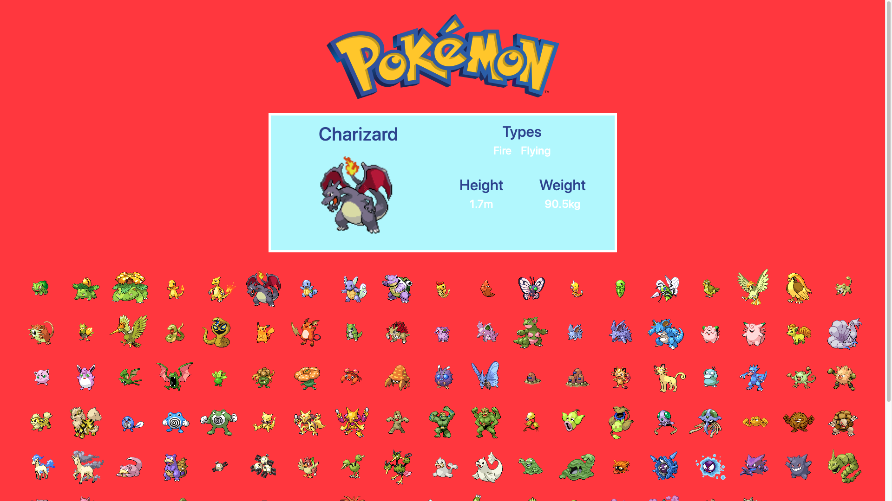

# PokedexAPI
This page uses the Pokemon API to display the first 150 shiny pokemon when the page loads. When a pokemon is clicked their image will be shown in the middle of the screen along with their stats such as type,height, and weight.

# What I learned
* Pokemon API
* Traversing JSON data
* Use of jQuery .html()
 
# Screenshots

